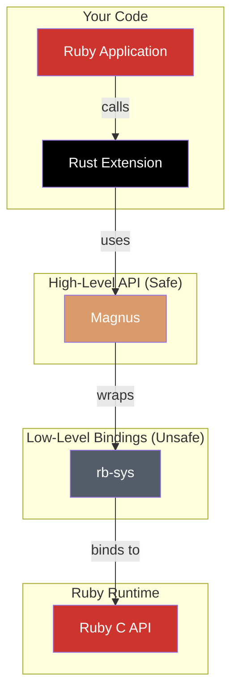

# Core Concepts

This page explains the mental models required to build safe and efficient Ruby extensions with Rust, focusing on the bridge between the two languages.

## The Ruby-Rust Bridge

`rb-sys` connects Ruby and Rust through several layers. It provides low-level, `unsafe` bindings to Ruby's C API. Higher-level libraries like [Magnus](https://github.com/matsadler/magnus) offer a safe, ergonomic wrapper.

<div className="architecture-diagram">



</div>

## Memory Models: Ruby vs. Rust

Bridging Ruby's Garbage Collector (GC) with Rust's ownership model is a key challenge. Rust references to Ruby objects must be "marked" to prevent premature collection by the GC, which would lead to segmentation faults.

| Aspect           | Ruby                    | Rust                         |
| :--------------- | :---------------------- | :--------------------------- |
| **Management**   | Garbage Collection (GC) | Ownership & Borrowing        |
| **Deallocation** | When GC decides         | When owner goes out of scope |
| **Safety**       | Managed by VM           | Enforced by compiler         |

## The Global VM Lock (GVL)

Ruby's GVL prevents true parallel execution of Ruby code. For CPU-intensive Rust code that doesn't interact with the Ruby VM, release the GVL to allow other Ruby threads to run concurrently.

#### When to Release the GVL

✅ **Release for:**

- CPU-bound computations (e.g., image processing, complex math).
- Blocking I/O operations (network requests, file system access).

❌ **Do not release for:**

- Any operation that calls back into the Ruby API.
- Very short operations where overhead outweighs benefits.

For a reusable GVL release helper, see the [Cookbook](./cookbook.mdx).

## Error Handling

Rust's `Result` type is the primary mechanism for error handling. A `Result<T, magnus::Error>` will automatically convert its `Err` variant into a Ruby exception.

```rust
use magnus::{Error, Ruby};

// A fallible operation.
fn divide(ruby: &Ruby, a: f64, b: f64) -> Result<f64, Error> {
    if b == 0.0 {
        Err(Error::new(ruby.exception_zero_div_error(), "divided by 0")) // Becomes `ZeroDivisionError` in Ruby.
    } else {
        Ok(a / b)
    }
}
```

For more details, see the [Error Handling](./error-handling.mdx) guide.

## Performance Mindset

Rust is chosen for performance, but FFI calls incur overhead. Maximize performance by minimizing "chatty" calls.

- **❌ Inefficient:** Ruby loop calling Rust function on each iteration.
- **✅ Efficient:** Single Ruby call passing a collection (e.g., `RArray`) to Rust for internal iteration.

```rust
use magnus::{RArray, Error, TryConvert};

// Efficiently sums an array by iterating on the Rust side.
fn efficient_sum(array: RArray) -> Result<i64, Error> {
    let mut sum = 0i64;
    for item in array.each() {
        sum += i64::try_convert(item?)?;
    }
    Ok(sum)
}
```

## Security Considerations

Native extensions can introduce vulnerabilities. Always validate input from Ruby.

```rust
use magnus::{Error, Ruby};

// Validates input to prevent excessive resource usage.
fn process_input(ruby: &Ruby, input: String) -> Result<(), Error> {
    const MAX_LENGTH: usize = 1_024;
    if input.len() > MAX_LENGTH {
        return Err(Error::new(ruby.exception_arg_error(), "input is too long"));
    }
    Ok(()) // Proceed with processing
}
```
