# Core Concepts

**Time:** 20 minutes | **Difficulty:** Intermediate

Understanding these core concepts will help you build safe, efficient Ruby extensions with Rust.

## The Ruby-Rust Bridge

rb-sys creates a bridge between Ruby and Rust through three layers:

<div className="architecture-diagram">


</div>

### Layer 1: Ruby C API

Ruby exposes a C API that allows native extensions to:
- Create Ruby objects
- Call Ruby methods
- Define new classes and modules
- Manage memory with Ruby's GC

### Layer 2: rb-sys (Low-Level)

rb-sys provides:
- **Safe Rust bindings** to Ruby's C API
- **Automatic header generation** using bindgen
- **Cross-platform compatibility**
- **Build system integration**

### Layer 3: Magnus (High-Level)

Magnus provides:
- **Ergonomic Rust API** that feels like Ruby
- **Type safety** with compile-time checks
- **Memory safety** guarantees
- **Automatic conversions** between Ruby and Rust types

## Memory Models: Ruby vs Rust

Understanding how memory works in both languages is crucial:

<table className="comparison-table">
<thead>
<tr>
<th>Aspect</th>
<th>Ruby</th>
<th>Rust</th>
</tr>
</thead>
<tbody>
<tr>
<td><strong>Memory Management</strong></td>
<td>Garbage Collection (GC)</td>
<td>Ownership & Borrowing</td>
</tr>
<tr>
<td><strong>Allocation</strong></td>
<td>Automatic on object creation</td>
<td>Explicit with ownership</td>
</tr>
<tr>
<td><strong>Deallocation</strong></td>
<td>GC decides when</td>
<td>When owner goes out of scope</td>
</tr>
<tr>
<td><strong>References</strong></td>
<td>All references are valid</td>
<td>Compiler enforces validity</td>
</tr>
</tbody>
</table>

### The Bridge Challenge

When Rust holds Ruby objects:
1. Ruby's GC doesn't know about Rust's references
2. Objects might be collected while Rust still uses them
3. This causes segmentation faults

**Solution:** Tell Ruby's GC about our references through marking.

## Type Conversions

Magnus handles conversions between Ruby and Rust types automatically:

### Basic Type Mappings

```rust
// Automatic conversions
fn example(
    s: String,        // Ruby String → Rust String
    i: i64,          // Ruby Integer → Rust i64
    f: f64,          // Ruby Float → Rust f64
    b: bool,         // Ruby true/false → Rust bool
    v: Vec<String>,  // Ruby Array → Rust Vec
) -> String {        // Rust String → Ruby String
    format!("Received: {} {} {} {} {:?}", s, i, f, b, v)
}
```

### Working with Ruby Objects

```rust
use magnus::{RHash, RArray, Value, Symbol, Error, TryConvert};

// Accept any Ruby object
fn process_data(value: Value) -> Result<String, Error> {
    // Check type at runtime
    if let Ok(hash) = RHash::try_convert(value) {
        // Work with Ruby Hash
        let size = hash.len();
        Ok(format!("Hash with {} entries", size))
    } else if let Ok(array) = RArray::try_convert(value) {
        // Work with Ruby Array
        Ok(format!("Array with {} elements", array.len()))
    } else {
        Ok("Unknown type".to_string())
    }
}

// Working with symbols
fn symbol_example() -> Symbol {
    Symbol::new("success")  // Returns :success in Ruby
}
```

## The Global VM Lock (GVL)

Ruby uses a Global VM Lock (GVL/GIL) that prevents true parallelism:

```rust
use rb_sys::rb_thread_call_without_gvl;
use std::os::raw::c_void;

// Structure to hold data
struct ProcessData {
    input: Vec<u8>,
    output: Vec<u8>,
}

// CPU-intensive operation
extern "C" fn expensive_computation(data: *mut c_void) -> *mut c_void {
    unsafe {
        let data = &mut *(data as *mut ProcessData);
        // Process data...
        data.output = data.input.clone();
    }
    std::ptr::null_mut()
}

// Release GVL for long operations
fn process_large_file(data: Vec<u8>) -> Vec<u8> {
    // For operations > 100ms, release the GVL
    if data.len() > 1_000_000 {
        let mut process_data = ProcessData {
            input: data,
            output: Vec::new(),
        };
        
        unsafe {
            rb_thread_call_without_gvl(
                Some(expensive_computation),
                &mut process_data as *mut _ as *mut c_void,
                None,
                std::ptr::null_mut(),
            );
        }
        
        process_data.output
    } else {
        data
    }
}
```

### When to Release the GVL

✅ **Release for:**
- CPU-intensive computations
- Network I/O operations
- File system operations
- Cryptographic operations

❌ **Don't release for:**
- Ruby object manipulation
- Quick operations (< 10ms)
- Memory allocation/deallocation

## Error Handling Philosophy

rb-sys embraces Rust's `Result` type for error handling:

```rust
use magnus::{Error, exception, function, Ruby};

fn divide(a: f64, b: f64) -> Result<f64, Error> {
    if b == 0.0 {
        Err(Error::new(
            exception::zero_div_error(),
            "divided by 0"
        ))
    } else {
        Ok(a / b)
    }
}

// Magnus automatically converts Result to Ruby exceptions
#[magnus::init]
fn init(ruby: &Ruby) -> Result<(), Error> {
    let module = ruby.define_module("MyMath")?;
    module.define_module_function("divide", function!(divide, 2))?;
    Ok(())
}
```

### Error Handling Best Practices

1. **Use Result everywhere** - Let Magnus handle conversions
2. **Map errors appropriately** - Use Ruby's exception hierarchy
3. **Provide context** - Include helpful error messages
4. **Fail fast** - Don't hide errors

## Build Process Deep Dive

Understanding the build process helps debug issues:

```mermaid
flowchart LR
    A[extconf.rb] --> B[Makefile]
    B --> C[cargo build]
    C --> D[lib.rs → .so/.bundle]
    D --> E[Ruby loads extension]
    
    F[Cargo.toml] --> C
    G[build.rs] --> C
```



### Key Files

**extconf.rb**
```ruby
require "mkmf"
require "rb_sys/mkmf"

create_rust_makefile("my_gem/my_gem") do |r|
  # Optional: specify Rust edition
  r.extra_rustflags = ["--edition", "2021"]
  
  # Optional: enable specific features
  r.features = ["performance"]
end
```

**Cargo.toml**
```toml
[dependencies]
magnus = { version = "0.7", features = ["embed"] }
rb-sys = { version = "0.9", features = ["stable-api-compiled"] }

[features]
default = []
performance = ["lto"]  # Link-time optimization

[profile.release]
lto = true
codegen-units = 1
```

## Platform Considerations

rb-sys handles platform differences automatically:

### Cross-Platform Safety

```rust
// rb-sys handles platform differences
use rb_sys::VALUE;
use magnus::RString;

// Same code works on all platforms
fn create_string() -> RString {
    RString::new("Hello from any platform!")
}
```

### Platform-Specific Code

```rust
#[cfg(target_os = "windows")]
fn platform_name() -> &'static str {
    "Windows"
}

#[cfg(target_os = "macos")]
fn platform_name() -> &'static str {
    "macOS"
}

#[cfg(target_os = "linux")]
fn platform_name() -> &'static str {
    "Linux"
}
```

## Performance Mindset

When building extensions, think about:

1. **Allocation costs** - Minimize Ruby object creation
2. **Conversion overhead** - Batch operations when possible
3. **GVL contention** - Release for long operations
4. **Memory locality** - Process data in chunks

### Performance Example

```rust
use magnus::{RArray, Error, TryConvert};

// ❌ Inefficient: Many Ruby allocations
fn inefficient_sum(numbers: Vec<i64>) -> i64 {
    numbers.iter().sum()  // Converts entire Vec at once
}

// ✅ Efficient: Process without conversions
fn efficient_sum(array: RArray) -> Result<i64, Error> {
    let mut sum = 0i64;
    
    // Iterate without converting to Vec
    for item in array.each() {
        sum += i64::try_convert(item?)?;
    }
    
    Ok(sum)
}
```

## Security Considerations

Building safe extensions requires attention to:

1. **Input validation** - Never trust user input
2. **Buffer bounds** - Use Rust's safety guarantees
3. **Integer overflow** - Use checked arithmetic
4. **Resource limits** - Prevent DoS attacks

```rust
use magnus::{Error, Ruby};

fn safe_operation(ruby: &Ruby, input: String) -> Result<String, Error> {
    // Validate input length
    const MAX_LENGTH: usize = 1_000_000;
    if input.len() > MAX_LENGTH {
        return Err(Error::new(
            ruby.exception_arg_error(),
            "input too large"
        ));
    }
    
    // Use checked arithmetic
    let count = input.chars().count();
    let doubled = count.checked_mul(2).ok_or_else(|| {
        Error::new(ruby.exception_range_error(), "overflow")
    })?;
    
    Ok(format!("Processed {} characters", doubled))
}
```

## 🎯 Key Takeaways

1. **rb-sys provides the bridge** between Ruby and Rust
2. **Magnus makes it ergonomic** with high-level APIs
3. **Memory safety requires marking** Ruby objects
4. **Type conversions are automatic** but have overhead
5. **The GVL limits parallelism** but can be released
6. **Errors use Result** and convert to exceptions
7. **Platform differences are handled** automatically
8. **Performance requires thought** about allocations
9. **Security is critical** - validate everything

## 📚 Next Steps

Now that you understand the core concepts:

- [**Project Setup**](project-setup) - Structure your gem properly
- [**Working with Ruby Objects**](working-with-ruby-objects) - Manipulate Ruby data
- [**Memory Management**](memory-management) - Deep dive into GC integration
- [**Error Handling**](error-handling) - Build robust extensions

---

<div className="success-message">

### 🧠 Understanding Complete!

You now have a solid foundation in rb-sys core concepts. Ready to build amazing extensions!

</div>