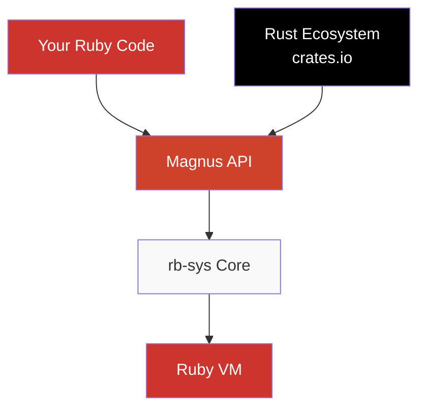

# Ruby + Rust = ❤️

**Ship safer, faster Ruby code by writing performance-critical parts in Rust.**

rb-sys makes building Ruby extensions in Rust easier than C, with memory safety guaranteed at compile time.

## See It In Action

```ruby
# Ruby code
require "my_gem"

# Call Rust from Ruby - it's that simple!
result = MyGem.process_data(large_dataset)
# => Processed 1M records in 0.2s
```

```rust
// Rust code (using Magnus high-level API)
use magnus::{function, prelude::*, Error, Ruby};

#[magnus::init]
fn init(ruby: &Ruby) -> Result<(), Error> {
    let module = ruby.define_module("MyGem")?;
    module.define_singleton_method("process_data", function!(process_data, 1))?;
    Ok(())
}

fn process_data(data: Vec<String>) -> Result<String, Error> {
    // Your fast, safe Rust code here
    Ok(format!("Processed {} records", data.len()))
}
```

## Why Choose Rust for Ruby Extensions?

### 🛡️ Memory Safety Without the Pain

C extensions are notorious for segfaults and memory leaks. Rust eliminates entire categories of bugs:

- No segmentation faults
- No memory leaks
- No data races
- No buffer overflows

### 🚀 Production Success Stories

These gems trust rb-sys in production:

- **[wasmtime-rb](https://github.com/bytecodealliance/wasmtime-rb)** - WebAssembly runtime serving millions of requests
- **[lz4-flex-rb](https://github.com/Shopify/lz4-flex-rb)** - 10x faster compression at Shopify scale
- **[blake3-rb](https://github.com/Shopify/blake3-rb)** - Cryptographic hashing 30x faster than OpenSSL

### ⚡ When to Use Rust

✅ **Perfect for:**
- CPU-intensive algorithms (parsing, compression, cryptography)
- Memory-intensive operations (data processing, image manipulation)
- System integration (FFI, hardware access, OS APIs)
- Concurrent operations (parallel processing, async I/O)

❌ **Keep Ruby for:**
- Business logic and application flow
- Simple CRUD operations
- Glue code and integrations
- Anything that's "fast enough" (YJIT makes Ruby faster than ever!)

## How It Works



### The Stack

1. **Your Ruby code** calls methods like any other Ruby library
2. **Magnus** provides an ergonomic, safe Rust API for Ruby objects
3. **rb-sys** handles the low-level Ruby C API bindings
4. **Rust ecosystem** - Use any crate from crates.io in your Ruby app!

## Quick Comparison

<table className="comparison-table">
<thead>
<tr>
<th>Feature</th>
<th>C Extensions</th>
<th>Rust + rb-sys</th>
</tr>
</thead>
<tbody>
<tr>
<td><strong>Memory Safety</strong></td>
<td>❌ Manual, error-prone</td>
<td>✅ Guaranteed by compiler</td>
</tr>
<tr>
<td><strong>Segfaults</strong></td>
<td>😱 Common in production</td>
<td>🛡️ Impossible*</td>
</tr>
<tr>
<td><strong>Development Speed</strong></td>
<td>🐌 Debug crashes for hours</td>
<td>🚀 Compiler catches errors</td>
</tr>
<tr>
<td><strong>Ecosystem</strong></td>
<td>📦 C libraries only</td>
<td>🎁 130,000+ crates on crates.io</td>
</tr>
<tr>
<td><strong>Learning Curve</strong></td>
<td>📈 Ruby C API is complex</td>
<td>📊 Magnus API feels like Ruby</td>
</tr>
<tr>
<td><strong>Cross-compilation</strong></td>
<td>🔧 Manual, platform-specific</td>
<td>🐳 Automated with Docker</td>
</tr>
</tbody>
</table>

<small>* When using safe Rust. Unsafe blocks require careful review.</small>

## Your First Extension in 15 Minutes

```bash
# 1. Install prerequisites (Ruby + Rust)
gem install rb_sys

# 2. Create a new gem with Rust support
bundle gem --ext=rust my_fast_gem
cd my_fast_gem

# 3. Build and test
bundle install
bundle exec rake compile
bundle exec rake test

# 🎉 You just built your first Ruby+Rust extension!
```

<details>
<summary>📺 <strong>See it in action</strong> (click to expand)</summary>

```bash
$ bundle exec bin/console
irb> MyFastGem.hello
=> "Hello from Rust!"
```

</details>

## Platform Support

### Supported Rubies
- ✅ Ruby 3.0+ (recommended)
- ✅ Ruby 2.6+ (minimum)
- ✅ TruffleRuby
- ✅ JRuby (experimental)

### Supported Platforms
- ✅ Linux (x86_64, aarch64)
- ✅ macOS (Intel & Apple Silicon)
- ✅ Windows (MSVC)
- ✅ Cross-compilation to all platforms

## Join the Community

<div className="community-links">

- 💬 **[Slack](https://join.slack.com/t/oxidize-rb/shared_invite/zt-16zv5tqte-Vi7WfzxCesdo2TqF_RYBCw)** - Get help and share experiences
- 🐛 **[GitHub Issues](https://github.com/oxidize-rb/rb-sys/issues)** - Report bugs or request features
- 📚 **[Examples](https://github.com/oxidize-rb/examples)** - Learn from working code
- 🎥 **[YouTube](https://www.youtube.com/watch?v=HT2JivOZ9zI)** - Watch talks and tutorials

</div>

## Ready to Build Something Amazing?

<div className="cta-buttons">

[🚀 **Start with the Quickstart** →](quick-start)

[📖 **Read the Installation Guide** →](getting-started)

[🔬 **Explore Real Examples** →](examples)

</div>

---

<small>

**License:** Apache-2.0 OR MIT | **Minimum Ruby:** 2.6+ | **Minimum Rust:** 1.65+

</small>